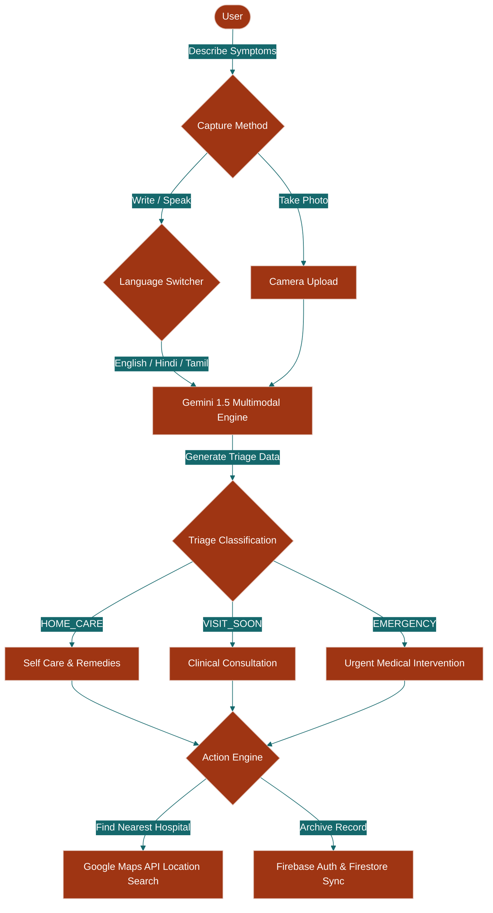
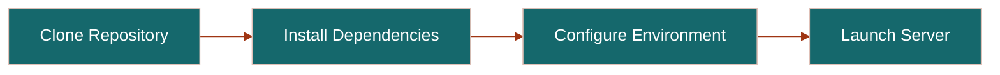
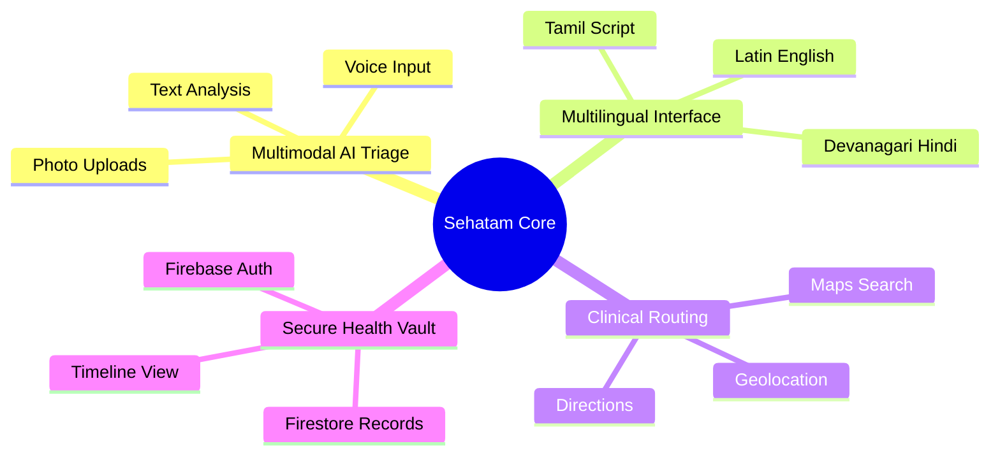
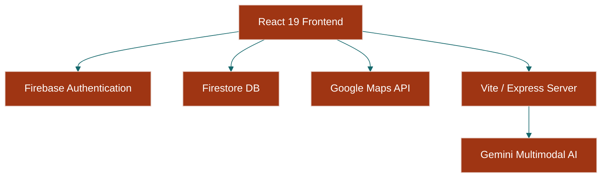

<div align="center">

# SEHATAM

### A Multilingual Multimodal AI Rural Health Assistant for India Built on Digital Khadi Principles

[](https://www.typescriptlang.org/) [](https://react.dev/) [](https://vitejs.dev/) [](https://tailwindcss.com/) [](https://firebase.google.com/) [](https://ai.google.dev/)

**Sehatam bridges the medical accessibility gap for rural families across India through direct, intuitive multimodal disease triage in native languages.**

</div>

---

## How It Works Visually



Your application captures user inputs via text, speech, or images of physical conditions.

The symptom payload is processed securely by the Gemini multimodal API inside our Express backend.

Structured medical classifications are rendered alongside adjacent healthcare providers mapped using Google Maps.

---

## Why This?

| Feature | Sehatam (AI Rural Assistant) | Generic Search (WebMD) | Generic AI Chatbots |
| :--- | :---: | :---: | :---: |
| **Multilingual Local Dialects** | ✅ English, Hindi, Tamil native scripts | ❌ English only or poor translations | ❌ Generic translations without localization |
| **Multimodal Photo Diagnosis** | ✅ Tailored visual analysis of ailments | ❌ Static text search with generic images | ✅ Raw vision analysis without safety guardrails |
| **Localized Physical Clinic Maps** | ✅ Automated clinical and hospital lookup | ❌ Static directory listings with no navigation | ❌ Static text outputs without geolocation |
| **Patient Progress Vault** | ✅ Offline-ready history synced to Firestore | ❌ Static logs saved locally or no history | ❌ Dynamic chat history with no structured records |
| **Digital Khadi Mobile UI** | ✅ Tailored 56px touch grids for low-literacy | ❌ Ad-cluttered structures with poor visibility | ❌ Cluttered chat prompts or rigid interfaces |

Sehatam is built specifically to address the unique visual, cultural, and logistical barriers of Indian rural healthcare.

---

## Quick Start



### Prerequisites

| Tool | Minimum Version | Purpose |
| :--- | :--- | :--- |
| **Node.js** | v18.0.0+ | Javascript runtime execution |
| **npm** | v9.0.0+ | Package manager and dependency tool |
| **Firebase Project** | v12.11.0+ | Live document and credential store |

1. Clone the repository onto your local workspace:
```bash
git clone https://github.com/rahulcvwebsitehosting/sehatam.git
cd sehatam
```

2. Run the dependency installation command:
```bash
npm install
```

3. Setup your environment keys based on the sample file:
```bash
cp .env.example .env
```

4. Populate your credential configurations within the new `.env` file:
```env
VITE_GEMINI_API_KEY="your_api_key"
VITE_MAPS_API_KEY="your_maps_key"
```

5. Launch the local development server to test active workflows:
```bash
npm run dev
```

---

## Features



### 🩺 Multimodal AI Triage
Upload clear photos of physical conditions or input text to receive instant triage.

The diagnostic pipeline classifies complaints into specific categories using Gemini 1.5 Flash.
```javascript
// Model instantiation using Google GenAI SDK
const ai = new GoogleGenAI({ apiKey: process.env.VITE_GEMINI_API_KEY });
```

### 🗣️ Multilingual Support
Translate medical advice dynamically into native Hindi, Tamil, or English scripts.

The interface adjusts font sizes automatically to maintain legibility of complex Indian glyphs.

### 📍 Localized Clinical Finder
Search for adjacent verified clinics and hospitals using Google Maps location APIs.

The UI filters locations dynamically based on active GPS coordinates.

### 🔒 Secure Health Vault
Store patient timelines securely in Firestore for medical history continuity.

Your personal records are gated securely behind Firebase Authentication rules.

---

## System Architecture



### Repo Directory Tree

```text
sehatam/
├── .env.example
├── .gitignore
├── README.md
├── firebase-applet-config.json
├── firebase-blueprint.json
├── firestore.rules
├── index.html
├── metadata.json
├── package.json
├── server.ts
├── tsconfig.json
├── vite.config.ts
├── public/
│   └── README.md
└── src/
    ├── App.jsx
    ├── index.css
    ├── main.jsx
    ├── components/
    │   ├── BottomNavBar.jsx
    │   ├── ErrorBoundary.jsx
    │   ├── Footer.jsx
    │   ├── LanguageToggle.jsx
    │   ├── Navbar.jsx
    │   └── ProtectedRoute.jsx
    ├── context/
    │   ├── AuthContext.jsx
    │   └── LanguageContext.jsx
    ├── pages/
    │   ├── Clinics.jsx
    │   ├── History.jsx
    │   ├── Home.jsx
    │   ├── Login.jsx
    │   ├── Results.jsx
    │   └── SymptomCheck.jsx
    └── services/
        ├── firebase.js
        └── gemini.js
```

### Repo Component Blueprint

| Path | Primary Technology | Core Responsibility |
| :--- | :--- | :--- |
| `src/services/gemini.js` | JavaScript | Requests, structure parsing, and safety configuration for Gemini models |
| `src/services/firebase.js` | JavaScript | Firestore schema storage and User Session handlers |
| `src/context/LanguageContext.jsx` | JavaScript | Real-time English, Hindi, and Tamil localized resource provider |
| `src/context/AuthContext.jsx` | JavaScript | Persistent reactive listener for patient accounts |
| `src/pages/SymptomCheck.jsx` | JavaScript | Capture engine for images, speech descriptions, and symptom logs |
| `src/pages/Results.jsx` | JavaScript | Triage indicator with warnings, predicted therapies, and hospital triggers |
| `src/pages/Clinics.jsx` | JavaScript | Hospital visualizer and locator utilizing Google Maps |
| `src/pages/History.jsx` | JavaScript | Patient medical chronological archive query engine |
| `server.ts` | TypeScript | Dev server compiler and secure local deployment proxy |

---

## Development Guide

### Prerequisites

| Runtime/Dependency | Purpose |
| :--- | :--- |
| **Node.js 18+** | Execution environment for server-side processes |
| **Firebase SDK** | Persistent storage synchronizer |
| **Gemini API** | Multimodal prompt processor |

1. Clone the repository onto your workspace:
```bash
git clone https://github.com/rahulcvwebsitehosting/sehatam.git
cd sehatam
```

2. Retrieve and compile dependency files:
```bash
npm install
```

3. Initiate the development environment using TypeScript execution:
```bash
npm run dev
```

4. Audit your codebase for potential type safety issues:
```bash
npm run lint
```

5. Compile production-ready assets for static web servers:
```bash
npm run build
```

---

## Honest Maintenance & Risk Assessment

Sehatam's diagnostic quality is strictly limited by the context and clarity of user inputs.

You must pay close attention to Gemini API and Google Maps usage limits since scaling this application can incur substantial pay-as-you-go database and computing costs.

The diagnostic reports generated by our underlying neural models must be treated as preliminary triage, not as certified clinical directives.

We maintain compatibility across external platforms by pinning our core dependencies in package.json.

Security updates to Firebase rules and custom Express endpoints must be audited regularly to protect health record compliance.

---

## FAQ

1. **Can Sehatam work completely offline?**
No, Sehatam requires a stable internet connection to run Gemini analysis and Google Maps queries.

2. **Is this application completely open source?**
Yes, the codebase is completely open source under the standard MIT License.

3. **How is patient health record privacy maintained?**
Patient history records are encrypted in transit and locked down behind rigorous Firebase security rules.

4. **Where are the Gemini and Maps API keys managed?**
API credentials are stored securely as server environment variables and never exposed directly to client browsers.

5. **Can this applet support additional Indian regional languages?**
Yes, you can add support for other languages by updating the LanguageContext dictionary.

6. **Does the clinical finder support headless coordinates?**
No, the clinical finder requires a valid Google Maps API payload with responsive visual interfaces.

---

## Contributing

You can report bugs, submit enhancements, or request new regional languages by raising issues on GitHub.

Submit your pull requests directly to our main trunk branch for review.

Our central tracker lives on [GitHub Issues](https://github.com/rahulcvwebsitehosting/sehatam/issues) with releases tracked under [GitHub Releases](https://github.com/rahulcvwebsitehosting/sehatam/releases).

```bash
git checkout -b feature/your-feature
# Make modifications
git commit -m "Add custom visual feature"
git push origin feature/your-feature
```

---

## License & Attribution

This project is distributed under the [MIT License](LICENSE).

Special thanks to the creators of React, Tailwind CSS, Google Gemini, and Firebase.

We appreciate the inspiration drawn from traditional Indian handloom heritages and folk-art cultures.
